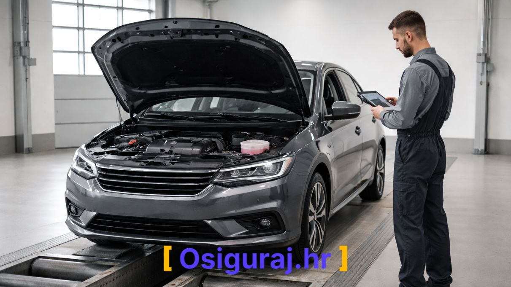
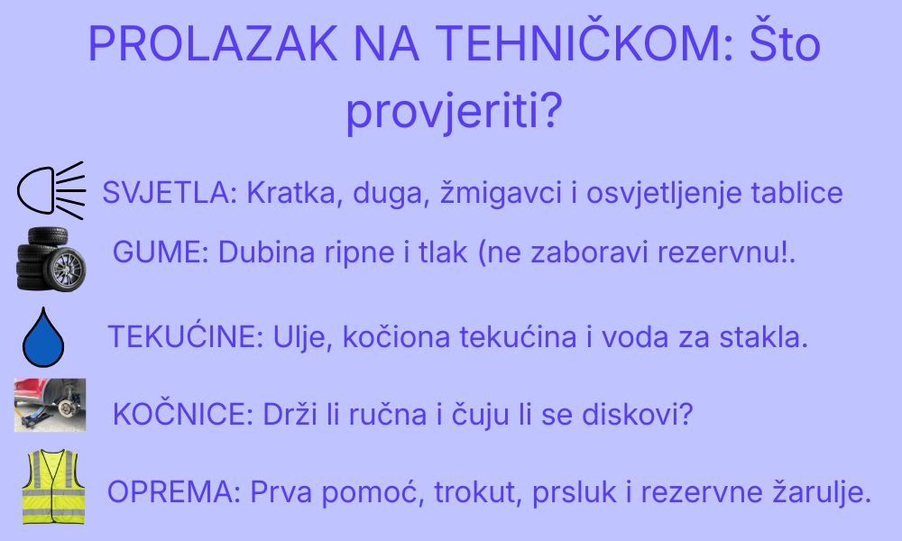

Planirate tehnički pregled u 2026. godini? Bez obzira vozite li novi hibrid ili provjereni klasik, priprema je ključ uštede vremena i novca. U ovom vodiču donosimo sve aktualne informacije o cijenama, postupku i najčešćim razlozima pada na pregledu.

## Koliko košta tehnički pregled u 2026.?

Cijene tehničkog pregleda i popratnih davanja (naknada za ceste, ekološka naknada) podložne su promjenama, ali okvirni trošak za osobno vozilo M1 kategorije kreće se od **150 € do 250 €**, ovisno o snazi motora (kW), vrsti goriva i emisiji CO2.

### Okvirni cjenik davanja:
* **Tehnički pregled (rad stanice):** cca 30 - 45 €
* **Eko-test:** 15 - 20 € (ovisno o motoru)
* **Naknada za ceste:** Ovisi o zapremnini motora.
* **Posebna naknada za okoliš:** Ovisi o vrsti goriva i emisiji.

> **Savjet:** Najveća ušteda se zapravo ostvaruje na **auto osiguranju**. Prije nego što krenete na liniju, provjerite naš [besplatni kalkulator osiguranja](/izracunaj-cijenu/) i uštedite do 30% na polici.

---

## Checklista: 5 stvari koje morate provjeriti prije polaska

Statistike pokazuju da 15% vozila padne na tehničkom zbog banalnih grešaka. Provjerite ovo:

1. **Signalizacija:** Rade li sva svjetla (uključujući osvjetljenje tablice i žmigavce)?
2. **Tekućine:** Provjerite razinu ulja i tekućine za pranje stakla.
3. **Gume:** Provjerite dubinu ripne i tlak u gumama.
4. **Obvezna oprema:** Imate li ispravan vatrogasni aparat (za komercijalna vozila), trokut, prvu pomoć i rezervne žarulje?
5. **Dokumenti:** Pripremite prometnu dozvolu i dokaz o uplaćenoj polici obveznog osiguranja.

---

## Tehnički pregled po gradovima (Hrvatska 2026)

Lokalne stanice za tehnički pregled (STP) mogu imati različita radna vremena i razinu gužve. Odaberite svoj grad za detaljne informacije, lokacije i savjete specifične za vašu regiju:

| Regija | Dostupni Gradovi |
| :--- | :--- |
| **Grad Zagreb i okolica** | [Zagreb](/tehnicki-pregled/zagreb/) • [Sesvete](/tehnicki-pregled/sesvete/) • [Samobor](/tehnicki-pregled/samobor/) • [Velika Gorica](/tehnicki-pregled/velika-gorica/) • [Zaprešić](/tehnicki-pregled/zapresic/) |
| **Središnja Hrvatska** | [Karlovac](/tehnicki-pregled/karlovac/) • [Sisak](/tehnicki-pregled/sisak/) • [Varaždin](/tehnicki-pregled/varazdin/) • [Krapina](/tehnicki-pregled/krapina/) • [Koprivnica](/tehnicki-pregled/koprivnica/) • [Bjelovar](/tehnicki-pregled/bjelovar/) |
| **Slavonija i Baranja** | [Osijek](/tehnicki-pregled/osijek/) • [Slavonski Brod](/tehnicki-pregled/slavonski-brod/) • [Vinkovci](/tehnicki-pregled/vinkovci/) • [Vukovar](/tehnicki-pregled/vukovar/) • [Đakovo](/tehnicki-pregled/dakovo/) • [Požega](/tehnicki-pregled/pozega/) |
| **Dalmacija** | [Split](/tehnicki-pregled/split/) • [Zadar](/tehnicki-pregled/zadar/) • [Šibenik](/tehnicki-pregled/sibenik/) • [Dubrovnik](/tehnicki-pregled/dubrovnik/) • [Makarska](/tehnicki-pregled/makarska/) • [Imotski](/tehnicki-pregled/imotski/) |
| **Istra i Kvarner** | [Rijeka](/tehnicki-pregled/rijeka/) • [Pula](/tehnicki-pregled/pula/) • [Pazin](/tehnicki-pregled/pazin/) • [Delnice](/tehnicki-pregled/delnice/) • [Gospić](/tehnicki-pregled/gospic/) |

---

## Česta pitanja (FAQ)

**1. Što ako padnem na eko-testu?**
Imate rok od 15 dana za otklanjanje kvara i ponovni dolazak na pregled bez ponovnog plaćanja pune cijene (plaća se samo eko-test).

**2. Može li se tehnički obaviti ranije?**
Da, tehnički pregled možete obaviti u bilo kojem trenutku unutar kalendarskog mjeseca u kojem vam istječe registracija.

**3. Trebam li kasko osiguranje za tehnički?**
Ne, za prolazak vam je potrebno samo [obvezno auto osiguranje (AO)](/kasko/). Ipak, kasko je preporučljiv za novija vozila radi zaštite vlastite investicije.

---

## Zaključak
Pravovremena priprema štedi novac. Provjerite svoje vozilo, osigurajte se na vrijeme i obavite tehnički pregled bez stresa. Za najbrži izračun cijene osiguranja, posjetite naš [digitalni servis](/izracunaj-cijenu/).
